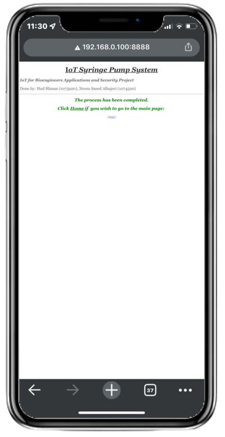

# IoT-Syringe-Pump

## Overview

Syringe pumps are widely used in medical, research, and industrial settings to deliver precise amounts of liquid. This project focuses on designing and developing an **IoT-enabled syringe pump** with a **web interface**, enabling remote operation and precise dosage control.

---

## Components Used

1. **Microcontroller**: Raspberry Pi 4 Model B
2. **Actuator**: NEMA-17 Stepper Motor
3. **Motor Driver**: DRV8825 Stepper Motor Driver
4. **User Interface**: Touch LCD Screen
5. **Power Supply**: 12V adapter for motor, 5V for Raspberry Pi
6. **Medical Components**: IV bag, IV set, plastic syringes (5ml, 10ml, 20ml)
7. **Mechanical Parts**: 3D-printed housing, lead screw, couplings, bearings, linear shafts (**3D design files available in** `./3D.zip`)

---

## Design

### System Overview

The **IoT-Enabled Syringe Pump** consists of three main components:

1. **Mechanical Unit**: A stepper motor, lead screw, and syringe mechanism convert rotational motion into precise linear displacement. (**Detailed documentation available in** `./IoT Syringe Pump.pdf`)
2. **Controller Unit**: A Raspberry Pi 4 running Python-based control algorithms manages motor operation and user interactions.
3. **Web Interface**: A secure, remote-access platform for setting dose volume, scheduling injections, and monitoring system status.

#### System Power Consumption

The system requires a **12V power supply** and must operate continuously for **at least 12 hours**.

##### **Power Consumption Per Component**

| **Component**               | **Voltage** | **Current Draw** |
| --------------------------- | ----------- | ---------------- |
| **Raspberry Pi 4**          | 5V          | 450mA            |
| **Touch LCD Screen**        | 5V          | 550mA            |
| **WiFi Module**             | 5V          | 100mA            |
| **DRV8825 Motor Driver**    | 12V         | 600mA            |
| **Stepper Motor (NEMA-17)** | 12V         | 240mA            |

##### **Stepper Motor Current Calculation**

The **NEMA-17 stepper motor** operates at **12V DC** with a **DC resistance of 50Ω ±7%**. To calculate the motor's current draw:  
I = 12V ÷ 50Ω = 0.24A

Since only **one motor** is used, the total motor power calculation is:
(12V × 0.24A) = 240mA

##### **Total System Power Consumption**

Summing up the current draw of all components:

450mA + 550mA + 240mA + 100mA + 600mA = 1940mA (1.94A)

##### **Power Bank Requirement for 12-Hour Operation**

To determine the required battery capacity:

1.94A × 12h = 23,280mAh

Rounding up for safety, conclude that a **25,000mAh power bank** is needed to sustain the system for at least **12 hours**.

---

### Component Design

#### UML State Chart (FSM Diagram)

To define system operation, a **Finite State Machine (FSM) diagram** was developed. **Available in** `./FSM IoT Syringe Pump.pdf` .

#### Hardware Schematic & Connections

**Table 1: Connections between Raspberry Pi 4 and Touch LCD Screen**

| Raspberry Pi 4     | Touch LCD Screen |
| ------------------ | ---------------- |
| 5V DC Power        | Power (Vcc 5V)   |
| Ground (GND)       | GND              |
| GPIO02 (SDA1, I2C) | SDA              |
| GPIO03 (SCL1, I2C) | SCL              |

**Table 2: Connections between Raspberry Pi 4 and DRV8825 Stepper Motor Driver**
| Raspberry Pi 4 | DRV8825 |
| -------------- | ------- |
| 5V DC Power | Vcc 5V |
| Ground (GND) | GND |
| GPIO24 | ENABLE |
| GPIO23 | STEP |
| GPIO22 | DIR |

**Table 3: Connections between DRV8825 Stepper Motor Driver and Stepper Motor (NEMA-17)**
| DRV8825 | NEMA-17 Stepper Motor |
| ------- | --------------------- |
| B1 | Red |
| B2 | Yellow |
| A1 | Blue |
| A2 | Green |

---

### Web Interface

#### Embedded Software (Python)

- The **Python-based control program** (`./main.py`) manages **motor control, web communication, and LCD interactions**.
- The **stepper motor movement** is controlled using GPIO signals from Raspberry Pi.
- The **dose volume and schedule** are set through the web interface.

#### Web Server Implementation

- A **web server** enables remote control of the syringe pump.
- **Port forwarding** allows access from devices on the same network.
- The web interface provides **fixed values for dose selection** based on medical standards.
- **Code Available in:**
  - `./IoT Syringe Pump/Main.html`
  - `./IoT Syringe Pump/Display.html`
  - `./IoT Syringe Pump/Cancel.html`

| Web Server Main Page                                                               | Web Server Display Page                                                               |
| ---------------------------------------------------------------------------------- | ------------------------------------------------------------------------------------- |
|  |  |

---

### Final Prototype

| Final Hardware Design                          | LCD Display for Local Control                  |
| ---------------------------------------------- | ---------------------------------------------- |
|  |  |

---

## License & Copyright

This project is licensed under the **MIT License**.

You are free to use, modify, and distribute this project for **educational and research purposes**, but proper credit must be given to the original author **(Noora-Alhajeri)**.

### **Copyright Notice**

© 2025 **Noora-Alhajeri**. All rights reserved.

Originally Developed: **August 16, 2022**
Uploaded to GitHub: **2025**

---

## Contact

For questions or collaboration, feel free to reach out:

📧 **Email:** [n.s3eedalhajeri@gmail.com](mailto:n.s3eedalhajeri@gmail.com)  
🌐 **LinkedIn:** [Noora-Alhajeri](https://www.linkedin.com/in/nsh-019)
